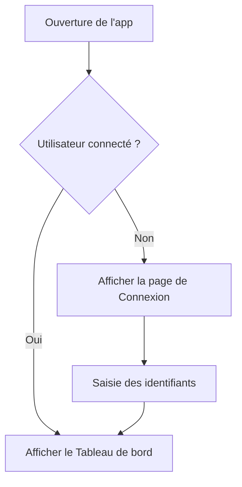

# Flow

```mermaid
graph TD
    A[Ouverture de l'app] --> B{Utilisateur connecté ?}
    B -- Oui --> C[Afficher le Tableau de bord]
    B -- Non --> D[Afficher la page de Connexion]
    D --> E[Saisie des identifiants]
    E --> C
```
